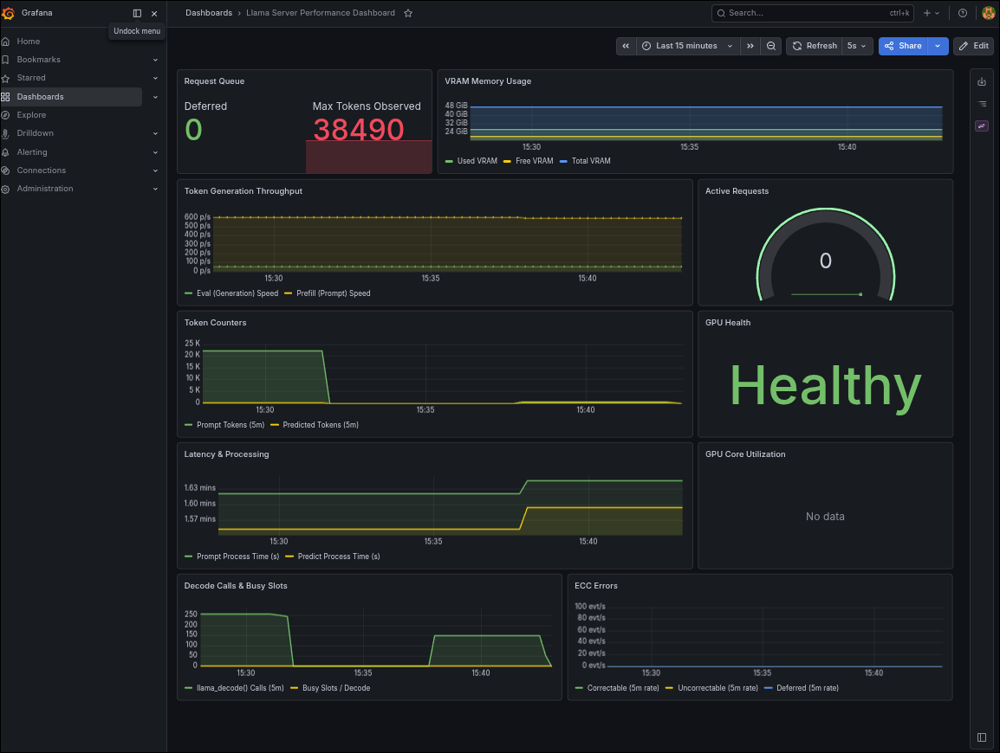

# llama.cpp ROCm Inference & Observability Stack

A self-contained, Docker Compose-based deployment stack for running **llama.cpp** with **AMD ROCm GPU acceleration**, paired with full-stack observability (Prometheus + Grafana) and a GGUF VRAM estimation utility.

Targeted at **AMD Strix Halo** (gfx1151) and similar RDNA 3/3.5 APU hardware, this stack compiles llama.cpp natively for the target GPU architecture and provides production-grade monitoring of both the inference server and the underlying GPU.

---

## Features

### 1. ROCm-Accelerated llama.cpp Server
- **Multi-stage Docker build** compiles llama.cpp from source with `GGML_HIP=ON` and `AMDGPU_TARGETS=gfx1151` (Strix Halo optimized)
- **UMA (Unified Memory Architecture)** support via `LLAMA_HIP_UMA=1` for seamless CPU/GPU memory pooling on APUs
- **SDMA workaround** (`HSA_ENABLE_SDMA=0`) for RDNA 3.5 APU stability
- Exposes the OpenAI-compatible API via `llama-server` with configurable context length, temperature, and model path
- Supports vision models via `--mmproj` (multi-modal projection) parameter

### 2. GGUF VRAM Estimator
- Standalone Python tool (`gguf-vram-estimator.py`) that parses GGUF model metadata to estimate VRAM requirements
- Reads architecture-specific KV cache parameters (`block_count`, `context_length`, `head_count_kv`, `key_length`, `value_length`, `sliding_window_size`)
- Handles multi-part GGUF files (e.g., `model-00001-of-00005.gguf`)
- Supports **Scout architecture** models with hybrid sliding-window/full attention layers
- Configurable overhead buffer for compute buffers and driver reserves
- Usage:
  ```bash
  python3 gguf-vram-estimator.py model.gguf -c 4096 8192 16384 --overhead 2.0
  ```

### 3. GPU Metrics Exporter (ROCm)
- Runs `rocm/device-metrics-exporter` in a dedicated container to expose GPU hardware telemetry as Prometheus metrics
- Exposes:
  - **VRAM usage** (total, free, used, visible)
  - **ECC error counts** (correctable/deferred/uncorrectable per hardware block: GFX, SDMA, ATHUB, MMHUB, etc.)
  - **GPU health status**
  - **XGMI interconnect throughput** (data beats, NOPs, requests/responses per neighbor link)
  - **GTT (Graphics Translation Table)** memory metrics
- Health endpoint at `http://localhost:9001/metrics`

### 4. Prometheus Time-Series Storage
- Scrapes metrics from both `llama-server` and `rocm-metrics` at 5-second intervals
- Provides long-term storage for GPU health trending, VRAM utilization tracking, and inference performance analysis

### 5. Grafana Dashboards
- Pre-provisioned datasource pointing to Prometheus
- Pre-loaded dashboard (`llama_dashboard.json`) for visualizing:
  - llama.cpp inference metrics (prompt tokens, predicted tokens, throughput, decode calls)
  - ROCm GPU metrics (VRAM, ECC, health, XGMI)
- Accessible at `http://localhost:3000` (default credentials: `admin/admin`)

### 6. llama-grammar Patch
- Applied patch increasing `MAX_REpetition_THRESHOLD` from 2000 to 100000 in `llama-grammar.cpp`
- Addresses constraint complexity limits for complex tool/function calling schemas (see [KYmidnight/amd-strix-halo-toolboxes#70](https://github.com/kyuz0/amd-strix-halo-toolboxes/issues/70))

---

## Metrics Reference

### llama-server Metrics (`/metrics` endpoint)

| Metric | Type | Description |
|--------|------|-------------|
| `llamacpp:prompt_tokens_total` | counter | Total prompt tokens processed |
| `llamacpp:prompt_seconds_total` | counter | Total time spent processing prompts |
| `llamacpp:tokens_predicted_total` | counter | Total generation (output) tokens produced |
| `llamacpp:tokens_predicted_seconds_total` | counter | Total time spent generating tokens |
| `llamacpp:n_decode_total` | counter | Total number of `llama_decode()` calls |
| `llamacpp:n_tokens_max` | counter | Largest observed context window (`n_tokens`) |
| `llamacpp:prompt_tokens_seconds` | gauge | Average prompt throughput (tokens/s) |
| `llamacpp:predicted_tokens_seconds` | gauge | Average generation throughput (tokens/s) |
| `llamacpp:requests_processing` | gauge | Currently processing requests |
| `llamacpp:requests_deferred` | gauge | Deferred requests |
| `llamacpp:n_busy_slots_per_decode` | gauge | Average busy slots per `llama_decode()` call |

### ROCm GPU Metrics (`:9001/metrics` endpoint)

#### VRAM & Memory
| Metric | Type | Description |
|--------|------|-------------|
| `gpu_total_vram` | gauge | Total GPU VRAM (MB) |
| `gpu_free_vram` | gauge | Free GPU VRAM (MB) |
| `gpu_used_vram` | gauge | Used GPU VRAM (MB) |
| `gpu_total_visible_vram` | gauge | Total visible VRAM (MB) |
| `gpu_free_visible_vram` | gauge | Free visible VRAM (MB) |
| `gpu_used_visible_vram` | gauge | Used visible VRAM (MB) |
| `gpu_total_gtt` | gauge | Total Graphics Translation Table memory (MB) |
| `gpu_free_gtt` | gauge | Free GTT memory (MB) |
| `gpu_used_gtt` | gauge | Used GTT memory (MB) |
| `gpu_vram_max_bandwidth` | gauge | Maximum VRAM bandwidth (GB/s) |

#### GPU Health
| Metric | Type | Description |
|--------|------|-------------|
| `gpu_health` | gauge | GPU health status (1 = healthy, 0 = unhealthy) |
| `gpu_nodes_total` | gauge | Number of GPUs in the node |

#### ECC Errors (Correctable)
Per hardware block: `gpu_ecc_correct_{athub,bif,df,fuse,gfx,hdp,ih,jpeg,mca,mmhub,mp0,mp1,mpio,sdma,sem,smn,umc,vcn,xgmi_wafl}` + `gpu_ecc_correct_total`

#### ECC Errors (Deferred)
Per hardware block: `gpu_ecc_deferred_{athub,bif,df,fuse,gfx,hdp,ih,jpeg,mca,mmhub,mp0,mp1,mpio,sdma,sem,smn,umc,vcn,xgmi_wafl}` + `gpu_ecc_deferred_total`

#### ECC Errors (Uncorrectable)
Per hardware block: `gpu_ecc_uncorrect_{athub,bif,df,fuse,gfx,hdp,ih,jpeg,mca,mmhub,mp0,mp1,mpio,sdma,sem,smn,umc,vcn,xgmi_wafl}` + `gpu_ecc_uncorrect_total`

#### XGMI Interconnect (per neighbor link 0–5)
| Metric | Type | Description |
|--------|------|-------------|
| `gpu_xgmi_nbr_{N}_beats_tx` | gauge | Data beats sent to neighbor N (32 bytes/beat) |
| `gpu_xgmi_nbr_{N}_nop_tx` | gauge | NOPs sent to neighbor N |
| `gpu_xgmi_nbr_{N}_req_tx` | gauge | Outgoing requests to neighbor N |
| `gpu_xgmi_nbr_{N}_resp_tx` | gauge | Outgoing responses to neighbor N |
| `gpu_xgmi_nbr_{N}_tx_thrput` | gauge | Outbound throughput on link N (bytes/sec) |

---

## Architecture

```
┌──────────────────────────────────────────────────────┐
│                   Docker Compose                     │
│                                                      │
│  ┌────────────────┐  ┌──────────────────────────┐    │
│  │  llama         │  │  rocm-metrics            │    │
│  │  (llama-server)│  │  (device-metrics-        │    │
│  │  :8080         │  │   exporter:5000)         │    │
│  │                │  │  :9001 (metrics)         │    │
│  └──────┬─────────┘  └──────────┬───────────────┘    │
│         │ scrape (5s)           │ scrape (5s)        │
│         ▼                       ▼                    │
│  ┌──────────────────────────────────────────┐        │
│  │         Prometheus (:9090)               │        │
│  │         (TSDB storage)                   │        │
│  └──────────────────────┬───────────────────┘        │
│                         │ query                      │
│                         ▼                            │
│  ┌──────────────────────────────────────────┐        │
│  │         Grafana (:3000)                  │        │
│  │         (dashboards)                     │        │
│  └──────────────────────────────────────────┘        │
└──────────────────────────────────────────────────────┘
         │
         ▼
   AMD GPU (gfx1151)
   /dev/kfd, /dev/dri
```

---

## Screenshots

### Grafana Dashboard



---

## Quick Start

### Prerequisites
- AMD GPU with ROCm drivers installed (Ubuntu 24.04 / Arch Linux)
- Docker & Docker Compose
- At least 16GB shared CPU/GPU memory (UMA mode)

### Launch
```bash
docker compose up -d --build
```

### Check Status
```bash
docker compose ps
```

### Access Services
| Service | URL |
|---------|-----|
| llama-server API | `http://localhost:8080` |
| ROCm GPU Metrics | `http://localhost:9001/metrics` |
| Prometheus | `http://localhost:9090` |
| Grafana | `http://localhost:3000` |

### Stop
```bash
docker compose down
```

---

## Configuration

Edit `.env` for runtime parameters:

| Variable | Default | Description |
|----------|---------|-------------|
| `PORT` | `8080` | llama-server HTTP port |
| `CONTEXT_LENGTH` | `2048` | Max context window in tokens |
| `TEMPERATURE` | `0.7` | Sampling temperature |
| `NGL` | `99` | GPU layer count (99 = all layers) |
| `FA` | `1` | Flash attention enable |
| `MODEL_PATH` | `/models/model.gguf` | Path to GGUF model inside container |
| `MMPROJ_PATH` | — | Multi-modal projection file (vision models) |

---

## File Structure

```
llama-cpp/
├── Dockerfile                    # Multi-stage ROCm build + runtime
├── compose.yaml                  # Docker Compose services
├── .env                          # Runtime configuration (env vars)
├── prometheus.yml                # Prometheus scrape config
├── gguf-vram-estimator.py        # GGUF VRAM estimation utility
├── llama-grammar.patch           # MAX_REPETITION_THRESHOLD patch
├── models  -> ./path/to/models   # Symlink to model directory
├── available_metrics_llama.md    # llama-server metrics reference
├── avilable_metrics_gpu.md       # ROCm GPU metrics reference
└── grafana/
    ├── provisioning/
    │   ├── datasources/          # Auto-provisioned Prometheus datasource
    │   └── dashboards/           # Auto-loaded dashboard definitions
    └── dashboards/
        └── llama_dashboard.json  # Pre-built monitoring dashboard
```

---

## Known Considerations

- **Strix Halo (gfx1151)**: The build is explicitly compiled for `gfx1151`. For other AMD GPUs, update `AMDGPU_TARGETS` in the Dockerfile and rebuild.
- **RDNA 3.5 APU stability**: `HSA_ENABLE_SDMA=0` is required on some RDNA 3.5 APUs to prevent system instability. Disable only if your hardware doesn't need it.
- **Unified memory**: `LLAMA_HIP_UMA=1` is critical for APU workloads where GPU and CPU share the same physical memory pool.
- **Model symlink**: The `models/` directory points to LM Studio's model cache. Update the symlink or bind-mount to point to your model storage.
